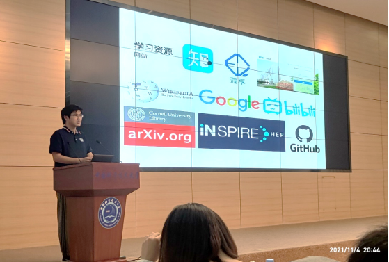
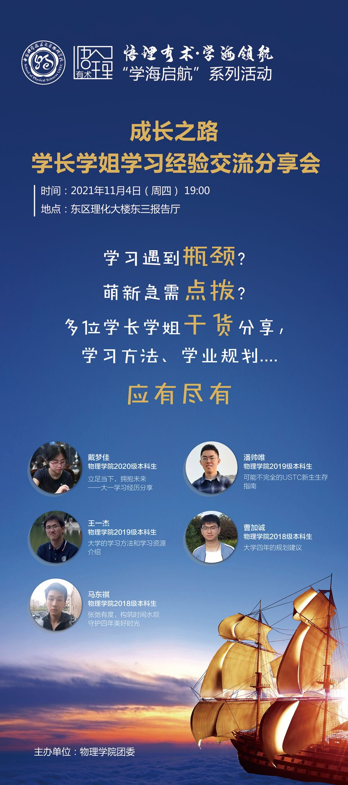

**Date: 11/04/2022**

The School of Physics holds a sharing meeting for seniors' learning experience.

On the evening of November 4th, the learning experience exchange and sharing meeting of the seniors of the School of Physics gave a wonderful lecture in the Dongsan Lecture Hall. Five 2018, 2019 and 2020 National Scholarship recipients from the School of Physics shared their experiences in academic planning and study methods with the students. This experience exchange and sharing meeting is the first lecture of a series of activities of the "Understanding Reason and Skills" student's academic and development guidance project.

**The following excerpt is a part of the report which is about me:**

Finally, Wang Yijie, a 2019 undergraduate, shared his experience. He mentioned that it is necessary to learn how to allocate time and proceed according to priorities. If you have spare time, you may wish to plan your course study in advance. He shared the experience of participating in CUPT, introduced various practical learning resources, and suggested that students make good use of network resources for learning.

[Original link](https://aga.ustc.edu.cn/info/1114/21879.htm)

**For details of my speech (in Chinese), please refer to this link: [My speech](https://mp.weixin.qq.com/s/bFfkzOJNhIfW3ALVWG1Fnw).**

